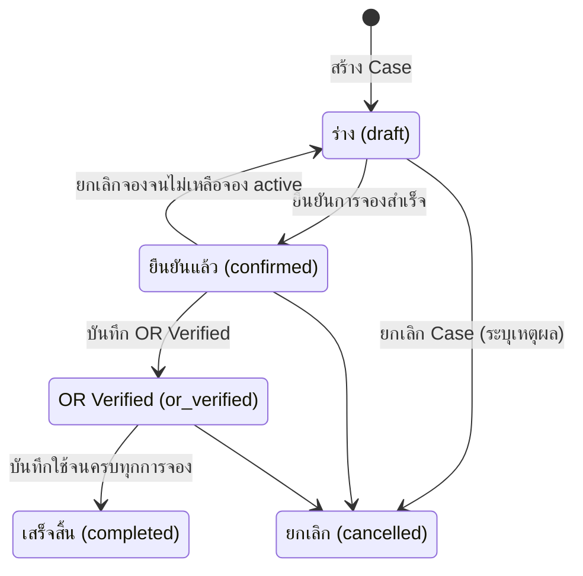
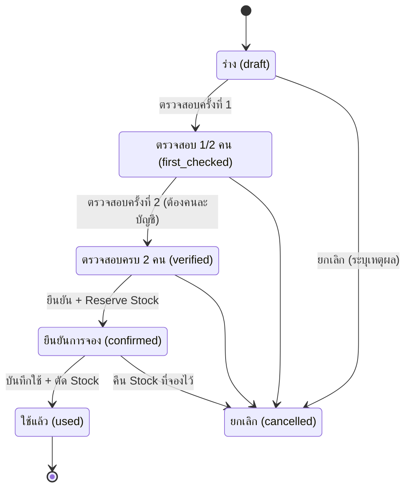
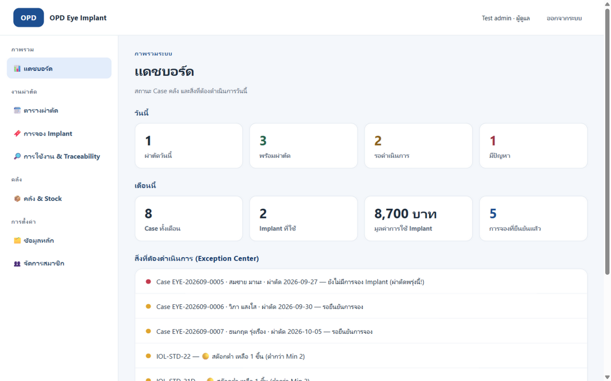
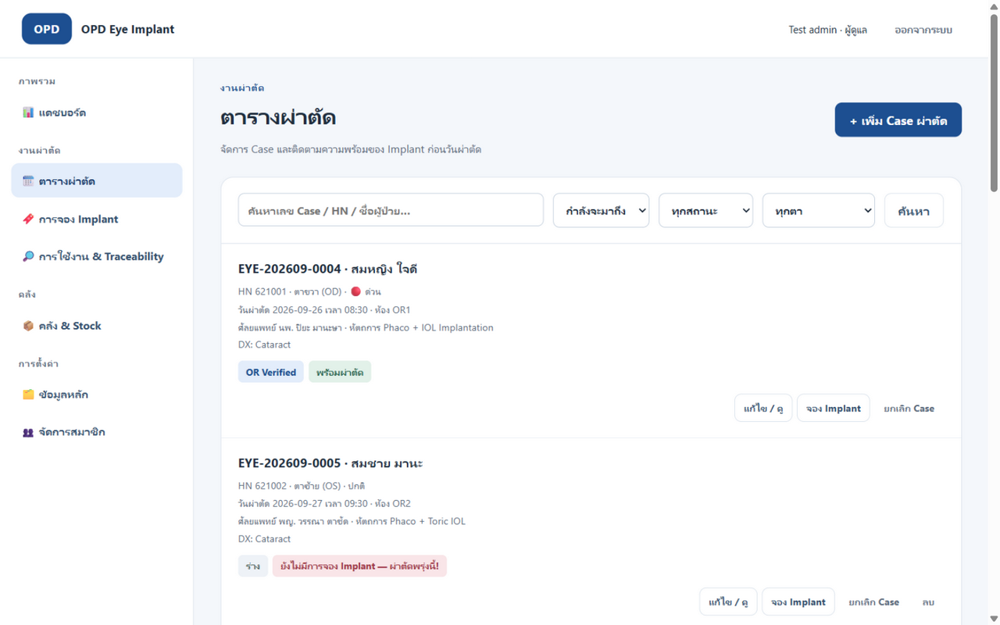
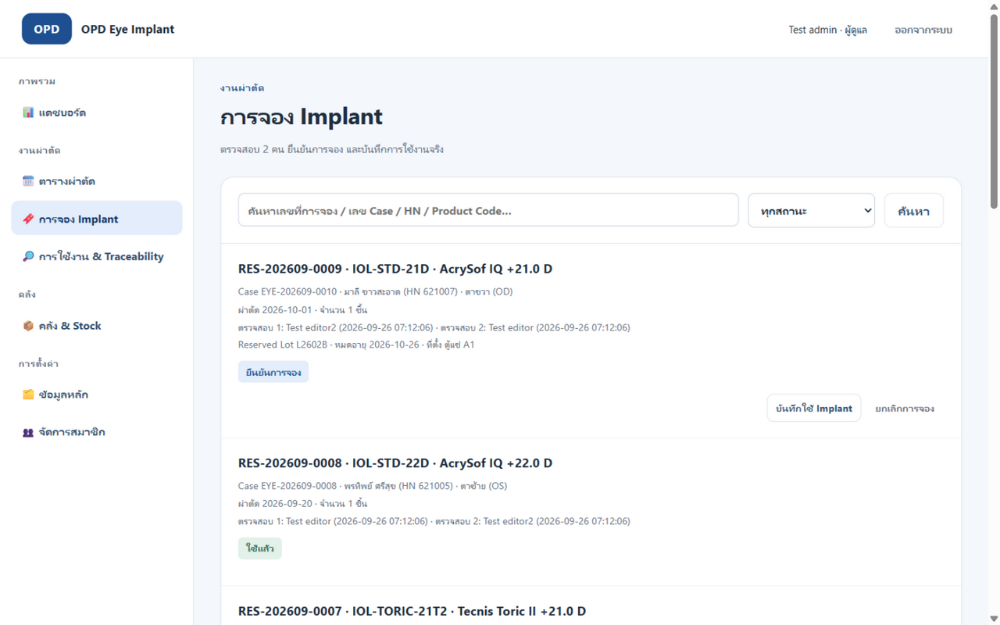
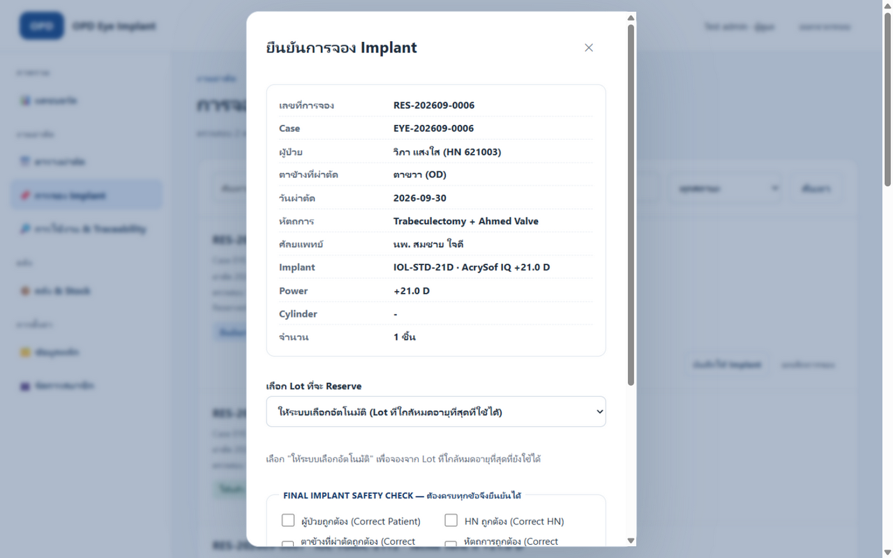
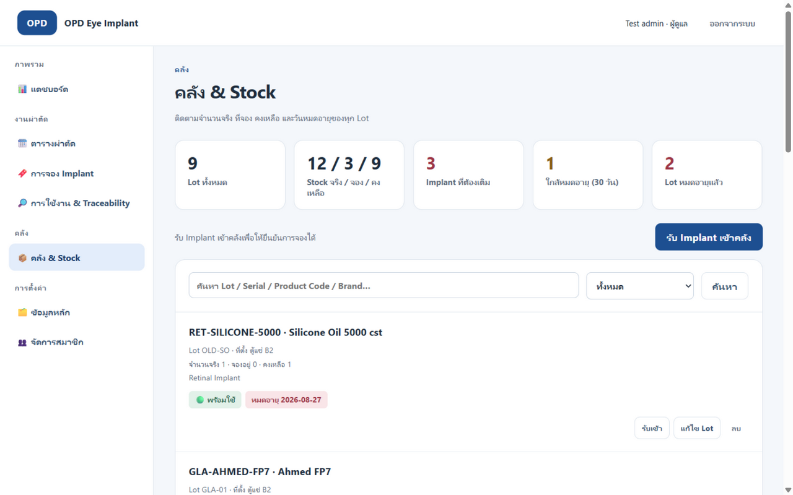
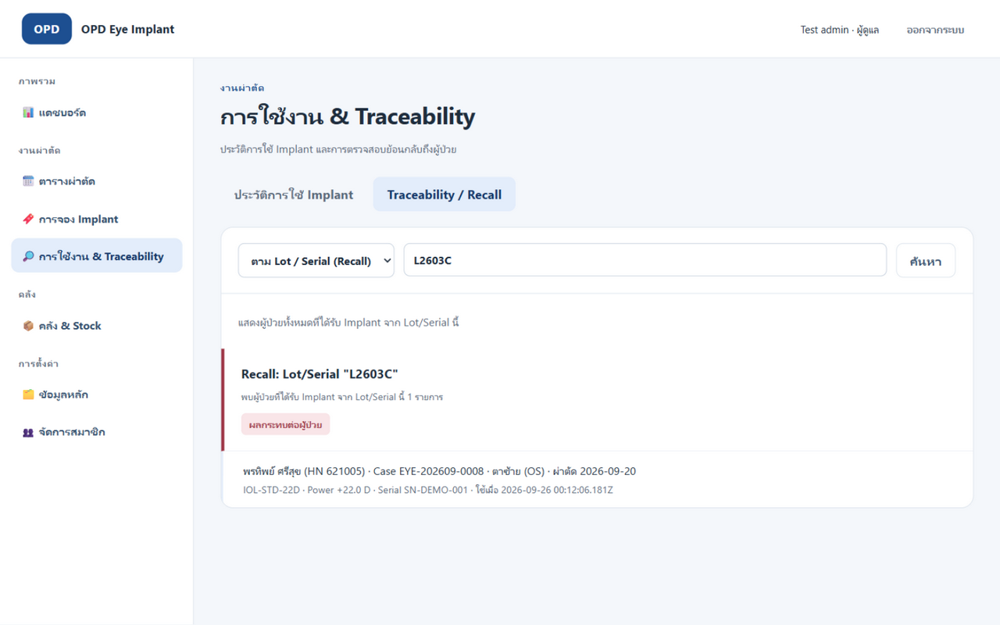
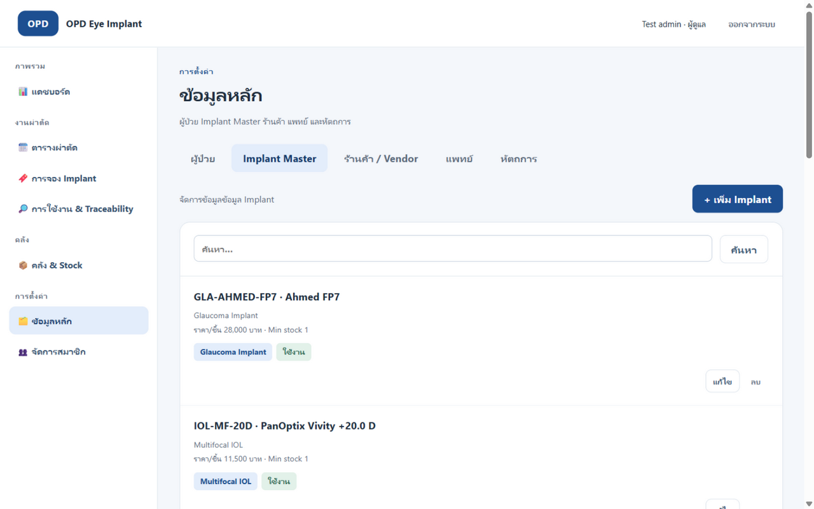
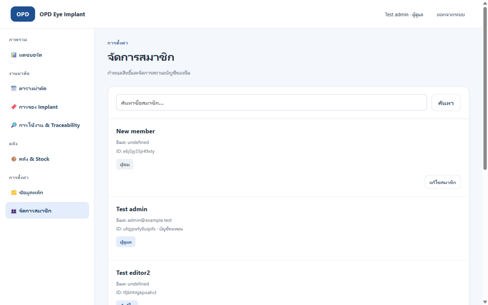

# คู่มือระบบ OPD Eye Implant & Lens Management

เอกสารฉบับสมบูรณ์ของระบบ: ภาพรวม, สถาปัตยกรรม, โครงสร้างข้อมูล, workflow, คู่มือใช้งานทุกโมดูล, API, การติดตั้ง, การทดสอบ และการแก้ปัญหา

---

## สารบัญ

1. [ภาพรวมระบบ](#1-ภาพรวมระบบ)
2. [สถาปัตยกรรมและเทคโนโลยี](#2-สถาปัตยกรรมและเทคโนโลยี)
3. [บทบาทผู้ใช้และสิทธิ์](#3-บทบาทผู้ใช้และสิทธิ์)
4. [โครงสร้างข้อมูล (Data Model)](#4-โครงสร้างข้อมูล-data-model)
5. [Workflow หลักของระบบ](#5-workflow-หลักของระบบ)
6. [คู่มือใช้งานทีละโมดูล](#6-คู่มือใช้งานทีละโมดูล)
7. [กฎความปลอดภัยและ Poka-Yoke](#7-กฎความปลอดภัยและ-poka-yoke)
8. [API Reference](#8-api-reference)
9. [การติดตั้งและ Deploy](#9-การติดตั้งและ-deploy)
10. [การทดสอบ](#10-การทดสอบ)
11. [แก้ปัญหาที่พบบ่อย](#11-แก้ปัญหาที่พบบ่อย)
12. [ข้อจำกัดและงานที่ยังไม่ทำ](#12-ข้อจำกัดและงานที่ยังไม่ทำ)

---

## 1. ภาพรวมระบบ

ระบบบริหาร Implant และ Lens สำหรับคลินิกจักษุ (ภาษาไทย) ออกแบบตามหลัก **ONE CASE → ONE DIGITAL RECORD → ONE SOURCE OF TRUTH** ครอบคลุมตั้งแต่:

```
Doctor Plan → Case ผ่าตัด → เลือก/จอง Implant → ตรวจสอบ 2 คน → ยืนยัน (Reserve Stock)
→ Surgery Readiness → OR Verified → ใช้ Implant จริง → ตัด Stock → Traceability/Recall
```

**เป้าหมายหลัก:** RIGHT PATIENT + RIGHT EYE + RIGHT PROCEDURE + RIGHT IMPLANT + RIGHT POWER + RIGHT LOT + RIGHT TIME + RIGHT VERIFICATION

**สิ่งที่ระบบทำให้อัตโนมัติ:**
- ออกเลขที่ Case (`EYE-YYYYMM-NNNN`) และเลขที่จอง (`RES-YYYYMM-NNNN`) ตามเวลา Bangkok
- Reserve / Release / ตัด Stock ตามสถานะการจอง แบบ atomic (transaction)
- บันทึก Audit Trail (`case_logs`) ทุกการเปลี่ยนสถานะ พร้อมชื่อผู้ทำรายการและเวลา
- Traceability 2 ทาง: ผู้ป่วย → Implant ที่ได้รับ และ Lot/Serial → ผู้ป่วยทุกราย (รองรับ Recall)
- แจ้งเตือน Exception: Case ใกล้ผ่าตัดที่ยังไม่พร้อม, สต๊อกต่ำ/หมด, Lot ใกล้/หมดอายุ

**สิ่งที่ไม่ได้ทำตามขอบเขต:** Purchase/PO Tracking, Reports/PDF, Google Drive, Email (ดูหัวข้อ 12)

---

## 2. สถาปัตยกรรมและเทคโนโลยี

```
Browser (public/ — HTML/CSS/JS ล้วน ไม่มี build step)
   ↓ fetch แบบ same-origin
PocketBase 0.39.8 (REST API + JSVM hooks)
   ↓
SQLite (pocketbase/pb_data)
```

| ส่วน | รายละเอียด |
| --- | --- |
| Frontend | HTML/CSS/JavaScript แบบ SPA, ไม่มี framework/dependency, ภาษาไทย, ธีมน้ำเงินคลินิก, sidebar (desktop) / hamburger drawer (mobile), render ด้วย `textContent` เท่านั้น (ป้องกัน XSS) |
| Backend | PocketBase API Rules (สิทธิ์) + JSVM Hooks (business rules) + Custom Routes (workflow) |
| Database | SQLite ผ่าน PocketBase, schema จัดการด้วย migration (`pocketbase/pb_migrations/`) |
| Session | Token เก็บใน `sessionStorage` (ปิดแท็บ = ออกจากระบบ), 401 → เคลียร์ session อัตโนมัติ |
| ไฟล์ static | PocketBase serve เฉพาะ `public/` เท่านั้น |

**ไฟล์สำคัญ:**

| ไฟล์ | หน้าที่ |
| --- | --- |
| `pocketbase/pb_migrations/1789800000_starter.js` | users collection (เดิมของ starter ห้ามแก้) |
| `pocketbase/pb_migrations/1790200000_eye_implant.js` | ทุก collection ของระบบ implant + ลบ `items` เดิม |
| `pocketbase/pb_hooks/workflow.pb.js` | Routes workflow ทั้งหมด (`/api/eyeimplant/*`) |
| `pocketbase/pb_hooks/validation.pb.js` | ตรวจข้อมูลฝั่ง server, ออกเลขอัตโนมัติ, change control |
| `pocketbase/pb_hooks/registration.pb.js` | สมัครสมาชิก (`/api/eyeimplant/register`, บังคับ viewer) |
| `public/app.js` | session, นำทาง sidebar, แดชบอร์ด |
| `public/cases.js` / `reservations.js` / `inventory.js` / `usage.js` / `masters.js` / `members.js` | โมดูลแต่ละหน้า |
| `public/ui.js` | helper ใช้ร่วม (list controller, dialog builder, คำนวณ readiness/expiry) |
| `public/api.js` | REST client + เรียก workflow routes |
| `public/config.js` | ชื่อแอป + ป้ายภาษาไทยทั้งหมด (LABELS) |

**ข้อควรรู้ทางเทคนิค (JSVM):** PocketBase รัน callback ของ hook นอก closure ของไฟล์ จึงต้องเขียน callback ให้ self-contained; goja (JSVM) ไม่รองรับ Intl เต็มรูปแบบ จึงคำนวณเวลา Bangkok ด้วย UTC+7 arithmetic; route pattern ต้องใช้ `{param}` ไม่ใช่ `:param`

---

## 3. บทบาทผู้ใช้และสิทธิ์

| สิทธิ์ | viewer (ผู้ชม) | editor (ผู้แก้ไข) | admin (ผู้ดูแล) |
| --- | :-: | :-: | :-: |
| อ่านข้อมูลทุกหน้า (รวม Traceability) | ✅ | ✅ | ✅ |
| สร้าง/แก้ไข ผู้ป่วย, Implant Master, ร้านค้า, แพทย์, หัตถการ | ❌ | ✅ | ✅ |
| สร้าง/แก้ไข Case, จอง Implant | ❌ | ✅ | ✅ |
| ตรวจสอบ 2 คน / ยืนยัน / OR Verified / บันทึกใช้ / ยกเลิก | ❌ | ✅ | ✅ |
| รับเข้าคลัง / แก้ไข Lot | ❌ | ✅ | ✅ |
| ลบ Case / ลบ Lot ในคลัง | ❌ | ❌ | ✅ |
| ลบรายการจอง (เฉพาะสถานะร่าง) | ❌ | ✅ | ✅ |
| จัดการสมาชิก (ชื่อ/สิทธิ์/เปิด-ปิดบัญชี**ของคนอื่น**) | ❌ | ❌ | ✅ |
| ลบบันทึกการใช้ Implant / Audit log / แก้ `qty_reserved` ตรง | ❌ | ❌ | ❌ (ห้ามทุกบทบาท — server เขียนเท่านั้น) |

- ทุกบทบาทต้อง **เข้าสู่ระบบ + บัญชี active** จึงเห็นข้อมูลใด ๆ (guest เห็น 0 รายการ)
- สิทธิ์บังคับที่ **PocketBase API Rules และ custom routes ฝั่ง server เสมอ** UI ซ่อนปุ่มเพียงเพื่อความสะดวก
- สมัครสมาชิกเองได้ที่หน้า register → ได้สิทธิ์ **viewer เสมอ** (client ส่ง role มาเองจะถูกละเว้น) มี honeypot กัน spam
- Admin **แก้บัญชีตัวเองไม่ได้** (กัน lockout) การกู้สิทธิ์ใช้ PocketBase dashboard หรือ setup script
- ปิดบัญชี = ล็อกอินไม่ได้ + token เดิมใช้ไม่ได้ทันที (ไม่ลบบัญชี)

---

## 4. โครงสร้างข้อมูล (Data Model)

### 4.1 `users` — บัญชีผู้ใช้
| ฟิลด์ | ประเภท | หมายเหตุ |
| --- | --- | --- |
| email / password | auth | ล็อกอินด้วยอีเมล |
| name | text (120) | แสดงในการตรวจสอบ/audit |
| role | select | `viewer` / `editor` / `admin` |
| active | bool | false = ใช้งานไม่ได้ทันที |

### 4.2 `patients` — ผู้ป่วย
| ฟิลด์ | ประเภท | หมายเหตุ |
| --- | --- | --- |
| hn | text (50) | **unique**, normalize เป็นตัวพิมพ์ใหญ่อัตโนมัติ |
| name | text (200) | ชื่อ-นามสกุล |
| dob | date text | ตรวจวันที่จริง (ก.พ. 30 ปฏิเสธ) |
| sex | select | `male` / `female` / `other` |
| phone / allergies / notes | text | ข้อมูลติดต่อ/ประวัติแพ้ยา |
| active | bool | ปิดใช้งานรายชื่อได้โดยไม่ลบ |

### 4.3 `implants` — Implant Master
| ฟิลด์ | ประเภท | หมายเหตุ |
| --- | --- | --- |
| product_code | text (60) | **unique**, ตัวพิมพ์ใหญ่อัตโนมัติ |
| implant_type | select | `standard_iol`, `toric_iol`, `multifocal_iol`, `edof_iol`, `phakic_iol`, `glaucoma_implant`, `retinal_implant`, `other` |
| brand / manufacturer / model | text | ข้อมูลผู้ผลิต |
| power / cylinder / a_constant | text | สเปกสายตา เช่น `+22.0 D` |
| material / description | text | |
| unit_price | number | ราคา/ชิ้น (บาท) ใช้คิดมูลค่าในแดชบอร์ด |
| min_stock / max_stock | int | เกณฑ์แจ้งเตือน 🟡 LOW STOCK (ไม่ใช่ยอดของจริง!) |
| vendor | relation → vendors | |
| lot_control / serial_control / expiry_control | bool | ตั้งค่าการควบคุม |
| active | bool | |

> ⚠️ **ระวังสับสน:** min/max stock เป็นแค่เกณฑ์แจ้งเตือน **ยอดของจริงอยู่ใน `stock_lots` เท่านั้น** ต้อง "รับ Implant เข้าคลัง" ก่อนจึงยืนยันการจองได้

### 4.4 `stock_lots` — คลังราย Lot
| ฟิลด์ | ประเภท | หมายเหตุ |
| --- | --- | --- |
| implant | relation → implants | required |
| lot / serial | text | เลข Lot/Serial จากผู้ผลิต |
| expiry | date text | วันหมดอายุ (วันที่หมดอายุ = ใช้ไม่ได้ในวันนั้นแล้ว) |
| qty_physical | int ≥ 0 | ยอดจริงในคลัง |
| qty_reserved | int ≥ 0 | ยอดที่ถูกจอง — **เขียนผ่าน API ตรงไม่ได้** ระบบจัดการเอง |
| location | text | ตู้/ชั้น เช่น `ตู้แช่ A1` |

**Available = qty_physical − qty_reserved** (สูตรเดียวที่ใช้ทั้งระบบ)

### 4.5 `surgery_cases` — Case ผ่าตัด
| ฟิลด์ | ประเภท | หมายเหตุ |
| --- | --- | --- |
| case_number | text | **unique**, ออกอัตโนมัติ `EYE-YYYYMM-NNNN` |
| patient | relation → patients | required |
| surgery_date | date text | required, ตรวจวันที่จริง |
| surgery_time | text HH:MM | เช่น `09:30` |
| eye | select | `od` (ขวา) / `os` (ซ้าย) / `ou` (สองข้าง) — **dropdown เท่านั้น ห้ามพิมพ์** |
| surgeon / procedure | relation | จากข้อมูลหลัก |
| diagnosis / or_room | text | |
| priority | select | `normal` / `urgent` |
| status | select | `draft` → `confirmed` → `or_verified` → `completed` และ `cancelled` |
| created_by | relation → users | ใส่อัตโนมัติจากผู้สร้าง |
| notes | text | |

### 4.6 `reservations` — การจอง Implant
| ฟิลด์ | ประเภท | หมายเหตุ |
| --- | --- | --- |
| reservation_number | text | **unique**, ออกอัตโนมัติ `RES-YYYYMM-NNNN` |
| case / implant | relation | required |
| power_snapshot / cylinder_snapshot | text | ดึงจาก Implant Master **ณ วันที่จอง** (แก้ master ภายหลังไม่กระทบของเดิม) |
| quantity | int 1–100 | จำนวนชิ้นที่จอง |
| status | select | `draft` → `first_checked` → `verified` → `confirmed` → `used`, และ `cancelled` |
| first_checker / first_check_at | relation + text | ตรวจครั้งที่ 1 |
| second_checker / second_check_at | relation + text | ตรวจครั้งที่ 2 (**ห้ามคนเดียวกับครั้งแรก**) |
| confirmed_by / confirmed_at / confirmed_lot | | ผู้ยืนยัน + Lot ที่ถูก reserve |
| cancel_reason | text | บังคับกรอกเมื่อยกเลิก |

### 4.7 `implant_usages` — การใช้จริง (Traceability) 🔒
| ฟิลด์ | หมายเหตุ |
| --- | --- |
| case / reservation / patient / implant | อ้างอิงครบ |
| lot / serial / expiry | คัดลอกจาก Lot ที่ reserve จริง |
| power | power ที่ใช้จริง (ดีฟอลต์จาก snapshot แก้ได้ตอนบันทึก) |
| remark / used_by / used_at | |

> 🔒 **อ่านได้อย่างเดียว** — create/update/delete ผ่าน API ปิดหมด สร้างได้ทาง route "use" เท่านั้น เพื่อให้ Stock ตัดพร้อมกับการบันทึกแบบ atomic และแก้/ลบประวัติไม่ได้

### 4.8 `case_logs` — Audit Trail 🔒
บันทึกทุก transition: `first_check`, `second_check`, `reservation_confirmed`, `reservation_cancelled`, `or_verified`, `implant_used`, `stock_received`, `case_cancelled` — พร้อม `detail` (ข้อความไทย + ชื่อผู้ทำ + เวลา Bangkok) — ทุกบัญชีอ่านได้ เขียนจาก server เท่านั้น

### 4.9 Master อื่น ๆ
`vendors` (ชื่อ unique, ผู้ติดต่อ, โทร, อีเมล), `doctors` (ชื่อ, แผนก), `procedures` (ชื่อ, หมวด) — ทุกตัวมี `active`

---

## 5. Workflow หลักของระบบ

### 5.1 สถานะ Case


### 5.2 สถานะการจอง


### 5.3 การเคลื่อนไหวของ Stock
| เหตุการณ์ | qty_physical | qty_reserved |
| --- | :-: | :-: |
| รับเข้าคลัง (Lot เดิมซ้ำ = รวมแถวเดิม) | ➕ | — |
| ยืนยันการจอง | — | ➕ |
| ยกเลิกการจอง/Case ที่เคยยืนยัน | — | ➖ (คืน) |
| บันทึกใช้จริง | ➖ | ➖ |

### 5.4 เงื่อนไขที่บังคับทุกขั้น (สรุป)
- ยืนยัน: ตรวจครบ 2 คน (คนละคน) + มี Lot ไม่หมดอายุ + Available ≥ จำนวนที่จอง
- ใช้จริง: Case ต้อง or_verified + Lot ยังไม่หมดอายุ (ตรวจซ้ำตอนตัด Stock)
- Auto-pick Lot = Lot ที่**ใกล้หมดอายุที่สุด**ที่ยังใช้ได้ (FIFO ตาม expiry)
- ยกเลิกทุกประเภท **ต้องระบุเหตุผล**

### 5.5 Readiness (สถานะความพร้อมต่อ Case)
| ป้าย | เงื่อนไข |
| --- | --- |
| 🟢 พร้อมผ่าตัด | ทุกการจอง (ที่ไม่ยกเลิก) confirmed/used บน Lot ที่ยังไม่หมดอายุ |
| 🟡 รอดำเนินการ | ยังไม่มีการจอง / จองแล้วยังไม่ยืนยัน |
| 🔴 มีปัญหา | ผ่าตัดวันนี้หรือพรุ่งนี้แต่ยังไม่พร้อม, Lot ที่จองหมดอายุ, เลยวันผ่าตัดแล้ว |
| ⚫ ยกเลิกแล้ว / เสร็จสิ้น | ตามสถานะ Case |

---

## 6. คู่มือใช้งานทีละโมดูล

> ภาพประกอบทั้งหมดถ่ายจากระบบจริงบน**ข้อมูลสมมติ** (จาก `node tests/integration.mjs --preview`) ไม่มีข้อมูลผู้ป่วยจริง

### 6.1 📊 แดชบอร์ด



- **วันนี้:** ผ่าตัดวันนี้ / พร้อมผ่าตัด / รอดำเนินการ / มีปัญหา
- **เดือนนี้:** Case ทั้งเดือน / Implant ที่ใช้ / มูลค่าการใช้ (ราคา×จำนวนจาก usage) / การจองที่ยืนยันแล้ว
- **Exception Center:** รายการที่ต้องดำเนินการ เรียงทั้ง Case 🔴/🟡, สต๊อกต่ำ/หมด, Lot ใกล้/หมดอายุ — **กดรายการเพื่อเปิดหน้าที่เกี่ยวข้องทันที**

### 6.2 🗓️ ตารางผ่าตัด



**สร้าง Case:** กด `+ เพิ่ม Case ผ่าตัด` → เลือกผู้ป่วย (หรือกด `+ ผู้ป่วยใหม่` สร้างในฟอร์มเดียว) → วัน/เวลาผ่าตัด → **เลือกตาข้างจาก dropdown เท่านั้น** → ศัลยแพทย์/หัตถการ/ห้อง/วินิจฉัย → บันทึก (สถานะเริ่ม = ร่าง)

**ค้นหา/กรอง:** คำค้น (เลข Case / HN / ชื่อผู้ป่วย), ช่วงเวลา (กำลังจะมาถึง / ทั้งหมด / ผ่านมาแล้ว), สถานะ, ตาข้าง

**ปุ่มดำเนินการต่อ Case (ตามสถานะ):**
| สถานะ | ปุ่มที่ใช้ได้ |
| --- | --- |
| ร่าง | แก้ไข / ดู · จอง Implant · ยกเลิก Case · ลบ (admin) |
| ยืนยันแล้ว | แก้ไข (ข้อมูลสำคัญล็อก) · จอง Implant · **บันทึก OR Verified** · ยกเลิก Case |
| OR Verified | แก้ไข · จอง Implant · ยกเลิก Case |
| เสร็จสิ้น / ยกเลิก | ดูอย่างเดียว |

**หลังยืนยัน Case แล้ว** ห้ามแก้ ผู้ป่วย / ตา / วันผ่าตัด / ศัลยแพทย์ / หัตถการ — ต้องยกเลิกแล้วสร้างใหม่ (server บังคับ)

### 6.3 🔖 การจอง Implant (หัวใจของระบบ)



**สร้างการจอง:** จากหน้าตารางผ่าตัด → `จอง Implant` → เลือก Implant (แสดงยอด Stock จริง/จอง/คงเหลือ + รายการ Lot ทันที) → จำนวน → สร้าง (ได้เลข RES-…)

**ตรวจสอบ 2 คน:** ที่การจองสถานะร่าง → `ตรวจสอบครั้งที่ 1` (คนที่ 1) → การจองจะล็อกการแก้ไข → คนที่ **2 ต้องเป็นคนละบัญชี** ล็อกอินและกด `ตรวจสอบครั้งที่ 2` — ทั้งสองครั้งระบบแสดงสรุป ผู้ป่วย/HN/ตา/วันผ่าตัด/Implant/Model/Power/Cylinder ให้ตรวจก่อนยืนยันทุกครั้ง

**ยืนยันการจอง (Reserve Stock):**



1. กด `ยืนยันการจอง` → dialog แสดงสรุปข้อมูล + dropdown เลือก **Lot** (แสดงวันหมดอายุและยอดคงเหลือของทุก Lot ที่ใช้ได้; เลือกอัตโนมัติ = Lot ใกล้หมดอายุสุด)
2. **FINAL IMPLANT SAFETY CHECK 12 ข้อ** — ต้องติ๊กครบทุกข้อ (ผู้ป่วย/HN/ตา/หัตถการ/Implant/Model/Power/Cylinder/Axis/Stock/Expiry/ตรวจ 2 คน) จึงกดยืนยันได้
3. ระบบ Reserve Stock ทันทีและเปลี่ยน Case เป็น "ยืนยันแล้ว"
4. ถ้าไม่มี Lot ที่ใช้ได้ dialog จะ**บอกเหตุผลของทุก Lot** (หมดอายุ / คงเหลือไม่พอ / ไม่มี Lot เลย) พร้อมรหัสสินค้า

**บันทึกใช้จริง:** หลัง OR Verified → `บันทึกใช้ Implant` → ตรวจ Power/Serial จริง (ดีฟอลต์จาก Lot) + หมายเหตุ → ยืนยัน → **ตัด Stock อัตโนมัติ** + สร้างประวัติ Traceability + Case เสร็จสิ้นเมื่อการจองทุกใบ settle

**ยกเลิก:** `ยกเลิกการจอง` (ต้องกรอกเหตุผล — ถ้าเคยยืนยันจะคืน Stock ทันที) หรือ `ยกเลิก Case` (ยกเลิกทุกการจองใน Case พร้อมกัน)

### 6.4 📦 คลัง & Stock



- แถว KPI: Lot ทั้งหมด / Stock จริง-จอง-คงเหลือ / Implant ที่ต้องเติม / ใกล้หมดอายุ 30 วัน / Lot หมดอายุแล้ว
- **รับ Implant เข้าคลัง:** กดปุ่ม `รับ Implant เข้าคลัง` (ใต้แถว KPI) → เลือก Implant → ใส่ **Lot / Serial / วันหมดอายุ / จำนวน / ที่ตั้ง** → บันทึก (ถ้า Lot/Serial/วันหมดอายุตรงแถวเดิม ระบบ**รวมจำนวน**ให้เอง)
- สถานะต่อแถว: 🟢 พร้อมใช้ / 🟡 LOW STOCK (ต่ำกว่า Min) / 🔴 OUT OF STOCK + ป้ายวันหมดอายุ 🟢/🟡 (≤30 วัน)/🔴
- แก้ไข Lot: แก้ Lot/Serial/วันหมดอายุ/ยอดจริง (นับเช็ก)/ที่ตั้ง ได้ — **ยอด "จอง" แก้ไม่ได้** (ผูกกับการจอง)
- กรอง: ทั้งหมด / ใกล้หมดอายุ / หมดอายุแล้ว

### 6.5 🔎 การใช้งาน & Traceability



- **ประวัติการใช้:** ทุกการใช้ Implant (Lot, Serial, วันหมดอายุ, Power, ผู้ป่วย, Case, เวลา) — แก้/ลบไม่ได้
- **Traceability 2 ทาง:** สลับแท็บ `Traceability / Recall`
  - **ตามผู้ป่วย:** กรอก HN หรือชื่อ → แสดง Implant ทุกชิ้นที่ผู้ป่วยได้รับ
  - **ตาม Lot/Serial (Recall):** กรอกเลข Lot หรือ Serial → แสดง **ผู้ป่วยทั้งหมด**ที่ได้รับจาก Lot นั้น (Case, ตา, วันผ่าตัด, Power) พร้อมป้ายเตือน 🔴

### 6.6 🗂️ ข้อมูลหลัก



แท็บย่อย 5 หมวด: **ผู้ป่วย / Implant Master / ร้านค้า (Vendor) / แพทย์ / หัตถการ** — เพิ่ม/แก้ไข/ลบ (ลบไม่ได้ถ้าถูกอ้างอิงอยู่) ทุกหมวดค้นหาได้ และเปิด/ปิด `active` แทนการลบ

### 6.7 👥 จัดการสมาชิก (admin เท่านั้น)



ค้นหาสมาชิก → แก้ ชื่อ / สิทธิ์ (viewer, editor, admin) / เปิด-ปิดบัญชี — ห้ามแก้ตัวเอง, ห้ามลบบัญชี (ใช้การปิดแทน)

---

## 7. กฎความปลอดภัยและ Poka-Yoke

| ความเสี่ยง | ระบบป้องกัน |
| --- | --- |
| ตาผิดข้าง | eye เป็น dropdown เท่านั้น (od/os/ou) + แสดงชัดทุกหน้าจอ |
| ตรวจสอบคนเดียวจบ | server ปฏิเสธครั้งที่ 2 ถ้าเป็นบัญชีเดียวกับครั้งแรก |
| ข้ามขั้นตอน | ทุก transition อยู่หลัง server routes — PATCH สถานะตรง ๆ ถูกปฏิเสธทุกกรณี |
| ใช้ Implant หมดอายุ | ยืนยัน/ใช้จริง ตรวจ expiry ทั้ง 2 จุด (วันที่หมดอายุ = ใช้ไม่ได้แล้วในวันนั้น) |
| Reserve เกิน Stock | ตรวจ Available ≥ จำนวน แบบ re-check ใน transaction |
| แก้ข้อมูลหลังยืนยัน | ล็อกผู้ป่วย/ตา/วันผ่าตัด/ศัลยแพทย์/หัตถการ; Case เสร็จ/ยกเลิก = แก้ไม่ได้เลย |
| แก้/ลบประวัติการใช้ | API ปิดทุก operation — มีแต่ระบบที่เขียนได้ |
| แก้ยอดจองลอย ๆ | `qty_reserved` ห้ามเขียนผ่าน records API |
| ยกเลิกมั่ว | บังคับกรอกเหตุผล + บันทึกใน audit log |
| สมัครเองแล้วได้สิทธิ์สูง | registration บังคับ viewer + ละเว้น field ที่ client ส่ง + honeypot |
| Duplicate ID | HN / Product Code / เลข Case / เลขจอง = unique index |
| วันที่ผิด | ตรวจปฏิทินจริงทั้ง client และ server (เช่น 30 ก.พ. ถูกปฏิเสธ) |

รายละเอียดขอบเขตความปลอดภัยเพิ่มเติม: [SECURITY.md](SECURITY.md)

---

## 8. API Reference

### 8.1 Records API (PocketBase มาตรฐาน)
```
GET    /api/collections/{collection}/records?page=&perPage=&sort=&filter=&expand=
POST   /api/collections/{collection}/records          (ตามสิทธิ์)
PATCH  /api/collections/{collection}/records/{id}     (ตามสิทธิ์ + เงื่อนไข hook)
DELETE /api/collections/{collection}/records/{id}     (ตามสิทธิ์)
```
- `collection`: `patients`, `implants`, `vendors`, `doctors`, `procedures`, `stock_lots`, `surgery_cases`, `reservations`, `implant_usages`, `case_logs`, `users`
- ต้องแนบ `Authorization: <token>` จาก login
- filter ใช้ภาษา PocketBase เช่น `surgery_date >= "2026-09-01" && status = "draft"`, expand ได้เช่น `expand=patient,implant,confirmed_lot`
- **ข้อจำกัดพิเศษ:** `stock_lots` ห้ามส่ง `qty_reserved` ใน body; `surgery_cases`/`reservations` ห้ามส่ง `status`; `case_logs`/`implant_usages` อ่านอย่างเดียว

### 8.2 Auth
```
POST /api/collections/users/auth-with-password   { identity, password } → { token, record }
POST /api/collections/users/auth-refresh         → ต่ออายุ/ตรวจ active
POST /api/eyeimplant/register                    { name, email, password, passwordConfirm } → สมัคร viewer
```

### 8.3 Workflow Routes — `POST /api/eyeimplant/{action}` (ต้องเป็น editor/admin)

| action | body | ผลลัพธ์ |
| --- | --- | --- |
| `verify` | `{ reservation, stage: "first" \| "second" }` | บันทึกการตรวจสอบ; ครั้งที่ 2 ต้องคนละบัญชี |
| `confirm` | `{ reservation, lot? }` | ยืนยัน + Reserve Stock (ไม่ส่ง lot = เลือกอัตโนมัติ); ตอบ `{ id, status: "confirmed", lot }` |
| `cancel-reservation` | `{ reservation, reason }` | ยกเลิก + คืน Stock; Case กลับเป็นร่างถ้าไม่มีจอง active |
| `or-verify` | `{ case }` | Case → or_verified |
| `use` | `{ reservation, power?, serial?, remark? }` | ตัด Stock + สร้าง implant_usages + Case เสร็จเมื่อครบ; ตอบ `{ id, caseStatus }` |
| `receive` | `{ implant, lot?, serial?, expiry?, quantity, location? }` | รับเข้าคลัง (รวมแถวเดิมถ้า Lot/Serial/Expiry ตรง); ตอบ `{ id }` ของ lot |
| `cancel-case` | `{ case, reason }` | ยกเลิก Case + การจองที่เปิดอยู่ทั้งหมด + คืน Stock |

**Error ทั้งหมดเป็นภาษาไทย** รูปแบบ `{ status: 400, message: "..." }` (เช่น ไม่ผ่าน 2 คน, Lot หมดอายุ, Stock ไม่พอ — ระบุรหัสสินค้าและสรุปจำนวน Lot)

### 8.4 ฟิลด์อัตโนมัติ (ห้ามส่งเอง)
`case_number`, `reservation_number`, `status` (ตอนสร้าง), `power_snapshot`/`cylinder_snapshot`, `created_by`, `qty_reserved` — hook เป็นผู้กำหนด

---

## 9. การติดตั้งและ Deploy

### 9.1 ติดตั้งครั้งแรก (Windows)
```powershell
./scripts/setup-pocketbase.ps1    # ดาวน์โหลด PB 0.39.8 + migrate + สร้าง superuser & บัญชี admin แรก
./scripts/start-pocketbase.ps1    # รันที่ http://127.0.0.1:8090/ (dashboard: /_/)
```
Linux/macOS: `bash scripts/setup-pocketbase.sh` / `start-pocketbase.sh` (ตัวแปร env: `PB_SUPERUSER_EMAIL/PASSWORD`, `PB_STAFF_EMAIL/PASSWORD/NAME/ROLE`)

### 9.2 อัปเดตเวอร์ชันบนเซิร์ฟเวอร์ (เช่น nopd2.insthync.com)
1. `git pull` (หรือคัดลอกไฟล์) ไฟล์ที่เปลี่ยน
2. ถ้ามี migration ใหม่ → รัน `pocketbase migrate up` (start script ทำให้อัตโนมัติ)
3. **รีสตาร์ท PocketBase** (hooks โหลดตอน start เท่านั้น — แก้ pb_hooks แล้วต้อง restart)
4. frontend เปลี่ยนแน่ ๆ → เปิดเว็บแล้ว **Ctrl+F5** (ระบบกันแคชด้วย `?v=YYYYMMDDHHmm` ใน index.html + register.html — **ต้อง bump พร้อมกันทั้งสองไฟล์ทุกครั้งที่แก้ frontend**)

### 9.3 ข้อควรระวังสำหรับ production
- ตั้งค่า **HTTPS**, rate limiting หน้า auth/register, จำกัดการเข้า `/_/` (dashboard)
- **ปิด public registration** ถ้าไม่ต้องการให้คนนอกสมัครเอง (บัญชี viewer อ่านข้อมูลผู้ป่วยได้ทั้งหมด) — แจ้งทีม dev เพื่อปิด route หรือทำ approval flow
- Backup ฐานข้อมูล (`pb_data/`) ตามปกติ + ทดสอบ restore
- ห้าม serve นอกจาก `public/` และห้าม commit credentials/binary/pb_data

---

## 10. การทดสอบ

```powershell
node tests/integration.mjs             # 135 assertions บนฐานข้อมูลชั่วคราว (OS temp) ไม่แตะของจริง
node tests/integration.mjs --preview   # คง server ไว้ + seed ข้อมูลสมมติ + พิมพ์ URL/รหัสผ่านทดสอบ
```

ชุดทดสอบครอบคลุม: migrate ซ้ำสองรอบ (idempotent), สิทธิ์ทุก collection, workflow ครบวงจร (จอง→ตรวจ 2 คน→ยืนยัน→OR→ใช้→ตัด Stock→เสร็จ), กันข้ามขั้นตอน, ห้าม Lot หมดอายุ, คืน Stock เมื่อยกเลิก, Traceability ทั้งสองทาง, สมัครสมาชิกบังคับ viewer, pagination/search, private-path 404

ข้อมูลสมมติใน `--preview`: ผู้ป่วย 12, Implant 9 (ครบ 8 ประเภท), แพทย์ 3, หัตถการ 4, ร้านค้า 2, Stock 6 Lot (รวม Lot หมดอายุ + ใกล้หมดอายุ), Case 7 สถานะครบทุกขั้น

---

## 11. แก้ปัญหาที่พบบ่อย

| อาการ | สาเหตุ / วิธีแก้ |
| --- | --- |
| ยืนยันการจองไม่ได้ บอกว่าไม่มี Stock ทั้งที่ "มีของ" | ยอดของจริงต้องเป็น **Lot ในหน้าคลัง** (ตัวเลข Min/Max ใน Implant Master ไม่ใช่ Stock) — ดูเหตุผลของทุก Lot ใน dialog ยืนยัน: หมดอายุ / ถูกจองหมด / ไม่มี Lot หรือรับเข้า Implant **ตัวเดียวกับ**ที่จอง |
| หน้าคลังไม่มีปุ่ม "รับ Implant เข้าคลัง" | เวอร์ชันเก่าค้าง — deploy ไฟล์ล่าสุดแล้ว **Ctrl+F5**; ปุ่มซ่อนสำหรับ viewer |
| หน้าเว็บยังเป็นของเก่าหลัง deploy | Browser cache — Ctrl+F5 (ตรวจ `?v=` ที่ address bar source ให้ตรงล่าสุด) |
| แก้ workflow/แล้วไม่มีผล | pb_hooks โหลดตอน start — **ต้องรีสตาร์ท PocketBase** |
| แก้ Case ไม่ได้ขึ้น "หลังยืนยันห้ามแก้..." | เจตนาของระบบ (change control) — ยกเลิก Case แล้วสร้างใหม่ |
| "ตรวจสอบครั้งที่ 2 ต้องทำโดยบุคคลที่แตกต่าง" | ต้องล็อกอินอีกบัญชี (editor/admin อื่น) กดตรวจครั้งที่ 2 |
| บัญชีล็อกอินไม่ได้ | บัญชีถูกปิด (active=false) — admin เปิดได้ที่หน้าสมาชิก; ลืมรหัส admin แรก → ใช้ setup script หรือ PB dashboard |
| เลข Case/จองซ้ำหรือผิดรูป | ระบบออกเองตามเดือนปัจจุบัน (Bangkok) ห้ามกรอกเอง — ถ้า import ข้อมูลเองให้เว้นช่องนี้ว่าง |
| ลบ Implant/ผู้ป่วยไม่ได้ | ถูกอ้างอิงโดย Case/คลัง — ปิด `active` แทน |
| ปุ่มหายไปทั้งหน้า (สำหรับบางบัญชี) | ตรวจสิทธิ์บัญชี (viewer เห็นอ่านอย่างเดียว) |

---

## 12. ข้อจำกัดและงานที่ยังไม่ทำ

- **ไม่มี** Purchase/PO Tracking, Reports/PDF, Google Drive, Email verification/recovery (ตัดออกตามขอบเขต)
- ข้อมูลใช้ร่วมทั้งทีม (single-team) ไม่มี tenant/เจ้าของแยก; Recall แสดงข้อมูลผู้ป่วยแก่ viewer ทุกคน — คุม membership ให้เข้มก่อนใช้ข้อมูลจริง
- สมัครสมาชิกสาธารณะเปิดอยู่ (บัญชีใหม่ = viewer) — production ควรปิด
- ไม่มี CI / production hosting package; Linux/macOS script ผ่าน syntax check เท่านั้น
- จำนวนต่อรายการ: จองสูงสุด 100 ชิ้น/ใบ, รับเข้าสูงสุด 1,000,000 ชิ้น/ครั้ง (จำกัดโดย schema)

---

*อัปเดตล่าสุด: 2026-09-26 (Asia/Bangkok) · เอกสารอื่น: [README](../README.md) · [ARCHITECTURE](ARCHITECTURE.md) · [SECURITY](SECURITY.md) · [HANDOFF](HANDOFF.md) · [CUSTOMIZE](CUSTOMIZE.md)*
